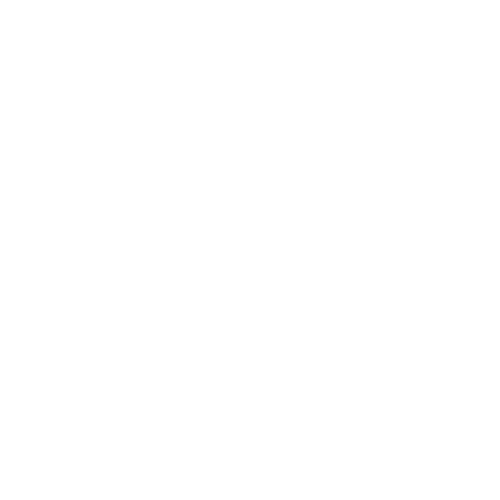
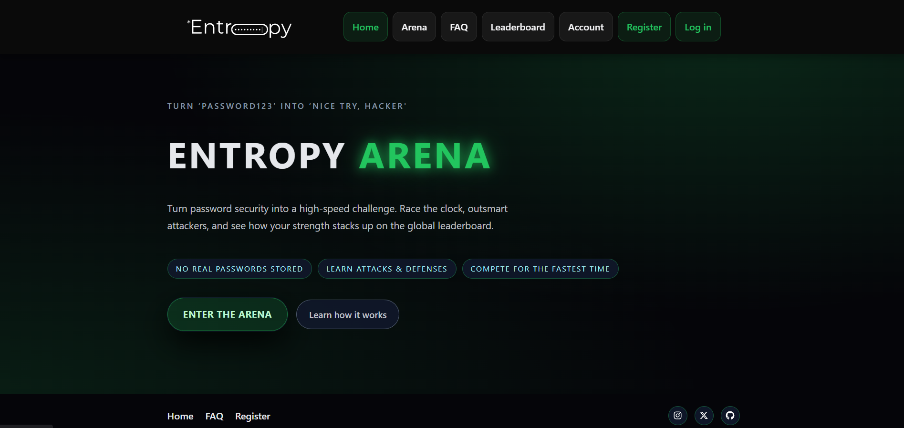
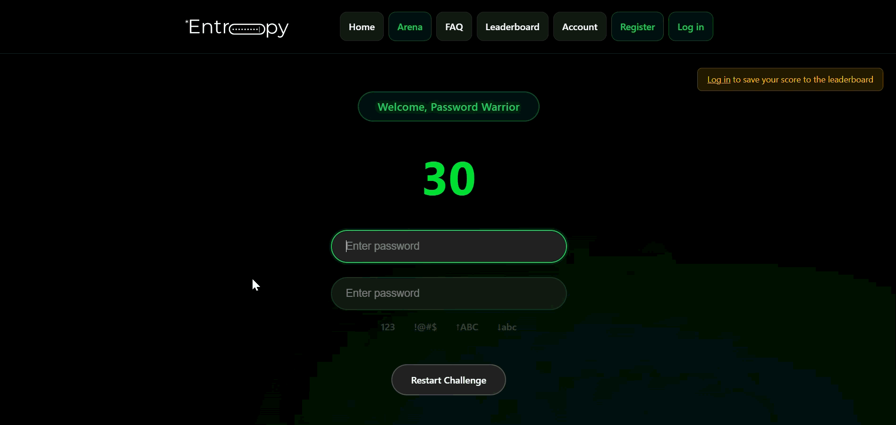
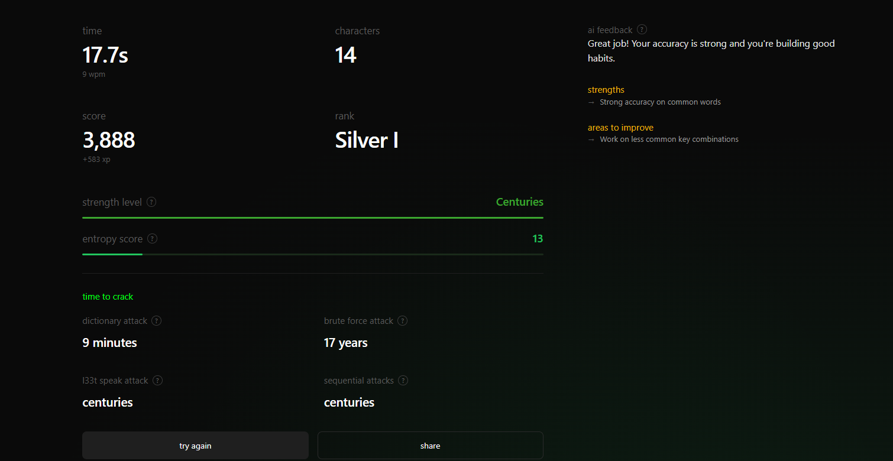
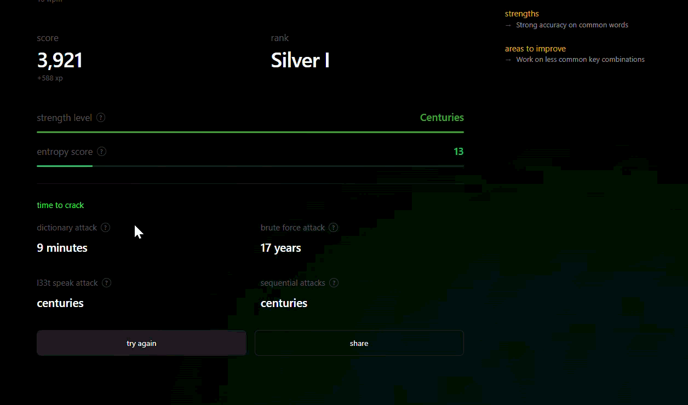
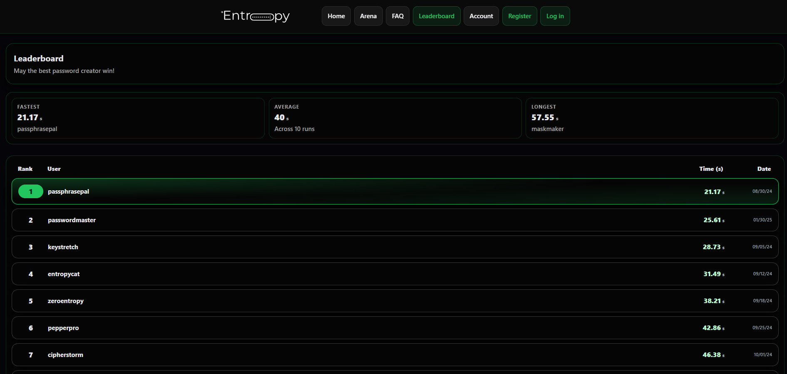

<div align="center">
  
</div>
A gamified cybersecurity education platform that teaches users how to build stronger passwords by testing them against real-world attack simulations, powered by AI-driven feedback and a live competitive leaderboard.

> **Note:** The live demo is currently offline to avoid ongoing AWS infrastructure costs. Full source code and deployment guide are available in this repository. Previously hosted at `https://development.d1zb36hw4mnhw5.amplifyapp.com`

---



---

## Table of Contents

- [Overview](#overview)
- [Features](#features)
- [Attack Simulations](#attack-simulations)
- [Screenshots](#screenshots)
- [Architecture](#architecture)
- [Tech Stack](#tech-stack)
- [Project Structure](#project-structure)
- [Getting Started](#getting-started)
- [Environment Variables](#environment-variables)
- [Deployment](#deployment)
- [Security](#security)
- [Contributors](#contributors)
- [License](#license)

---

## Overview

Most people do not understand why their passwords are weak until it is too late. Entropy Arena makes password security tangible — users submit a password, watch it get tested against four real attack types, receive personalized AI feedback from Claude, and compete on a live leaderboard within a 30-second challenge window.

Built by a four-person team during the Road to Hire coding apprenticeship program.

---

## Features

- Password strength analysis tested against four known cyber-attack vectors
- AI-powered feedback via Claude Haiku 4.5 — personalized, real-time security recommendations
- Gamified leaderboard with rankings by fastest completion time
- 30-second challenge timer for urgency-driven gameplay
- Secure user authentication with bcrypt password hashing and JWT
- Admin dashboard for managing users and scores
- No real passwords are ever stored

---

## Attack Simulations

| Attack Type | Description |
|---|---|
| Brute Force | Tests resistance to exhaustive character-by-character guessing |
| Dictionary Attack | Checks the password against common word lists and known leaked passwords |
| L33t Speak | Tests whether simple character substitutions (e.g. p@ssw0rd) can be detected and defeated |
| Sequential Attack | Identifies predictable patterns such as keyboard walks, number sequences, and repeated characters |

---

## Screenshots

### Arena — 30-Second Challenge



### Attack Results — Score Breakdown

Each completed challenge shows how long the password would take to crack under each attack type, alongside a strength level, entropy score, and AI-generated feedback with specific strengths and areas to improve.



The info modal on each attack type explains how that attack works and what makes a password resistant to it.



### Leaderboard



---

## Architecture

```
Browser → AWS Amplify (HTTPS) → AWS API Gateway (HTTPS) → EC2 / Node+Express → AWS RDS / MySQL
```

- **AWS Amplify** hosts the static React/Vite frontend and auto-deploys on every push to the connected GitHub branch
- **AWS API Gateway** provides an HTTPS endpoint that proxies requests to the EC2 backend, resolving browser mixed-content restrictions
- **EC2** runs the Express server managed by PM2 for persistent uptime and automatic restarts
- **AWS RDS** hosts the MySQL database inside a VPC — it is not publicly accessible and can only be reached from the EC2 instance

---

## Tech Stack

| Layer | Technology |
|---|---|
| Frontend | React, Vite |
| Backend | Node.js, Express |
| Database | MySQL (AWS RDS) |
| Cloud | AWS Amplify, EC2, API Gateway, RDS, VPC |
| Auth | JWT, bcrypt |
| AI | Claude Haiku 4.5 (Anthropic API) |
| Process Manager | PM2 |

---

## Project Structure

```
entropy-arena/
├── assets/                        # Screenshots and media for README
├── client/                        # React + Vite frontend
├── server/
│   └── server.js                  # Express server entry point
├── DEPLOYMENT_GUIDE.md            # Full AWS deployment walkthrough
├── cypress.config.js
├── entropy-arena-db.session.sql   # Database schema
├── eslint.config.js
├── index.html
└── package.json
```

---

## Getting Started

### Prerequisites

- Node.js v18+
- MySQL 8+
- An Anthropic API key for Claude AI feedback

### Installation

```bash
# Clone the repository
git clone https://github.com/KevoxChrist/Entropy-Arena.git
cd Entropy-Arena

# Install dependencies
npm install
```

### Running Locally

```bash
# Start the backend
cd server && npm run dev

# Start the frontend (in a separate terminal)
cd client && npm run dev
```

Visit `http://localhost:5173` in your browser.

---

## Environment Variables

Create a `.env` file inside the `/server` directory:

```env
PORT=5000
DB_HOST=your_mysql_host
DB_USER=your_mysql_user
DB_PASSWORD=your_mysql_password
DB_NAME=entropy_arena
JWT_SECRET=your_jwt_secret
ANTHROPIC_API_KEY=your_anthropic_api_key
```

Create a `.env.development` file at the project root:

```env
VITE_API_BASE_URL=http://localhost:5000
```

---

## Deployment

See [DEPLOYMENT_GUIDE.md](./DEPLOYMENT_GUIDE.md) for the complete step-by-step AWS setup including:

- Amplify frontend hosting connected to GitHub for CI/CD
- EC2 backend configuration with PM2
- API Gateway HTTPS proxy setup
- RDS MySQL database provisioning inside a VPC

---

## Security

- User passwords are hashed with **bcrypt** before storage — plain-text passwords are never saved to the database
- JWT tokens expire after 24 hours
- Passwords submitted for testing are **not persisted** — only scores and metadata are stored
- The RDS database lives inside an **AWS VPC** — the EC2 instance is the only resource with network access to it
- All credentials are managed through **environment variables** — no secrets are committed to source code

---

## Contributors

| Name | GitHub |
|---|---|
| Kevin Anderson | [@KevoxChrist](https://github.com/KevoxChrist) |
| Alex Irizarry | [@supernova147](https://github.com/supernova147) |
| Nia Manning | [@mann247](https://github.com/mann247) |
| Madison Duran | [@MadisonDuran](https://github.com/MadisonDuran) |

---

## License

MIT License — open for educational use and contributions.
